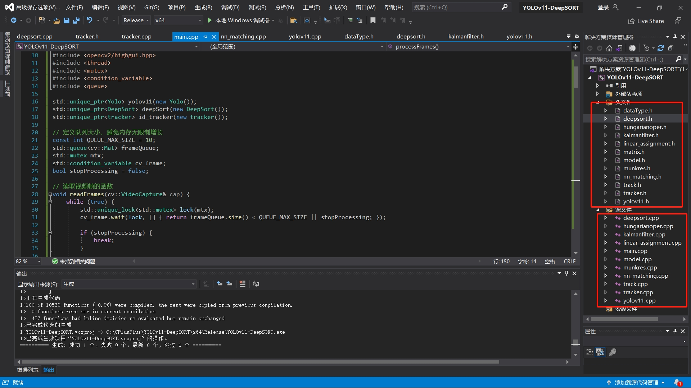
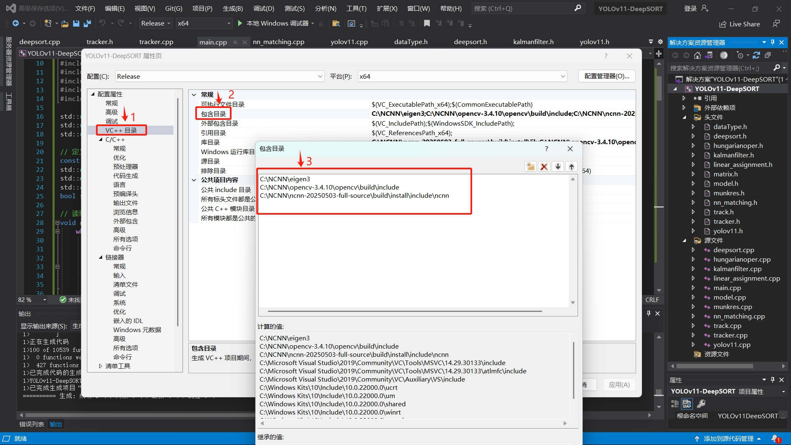
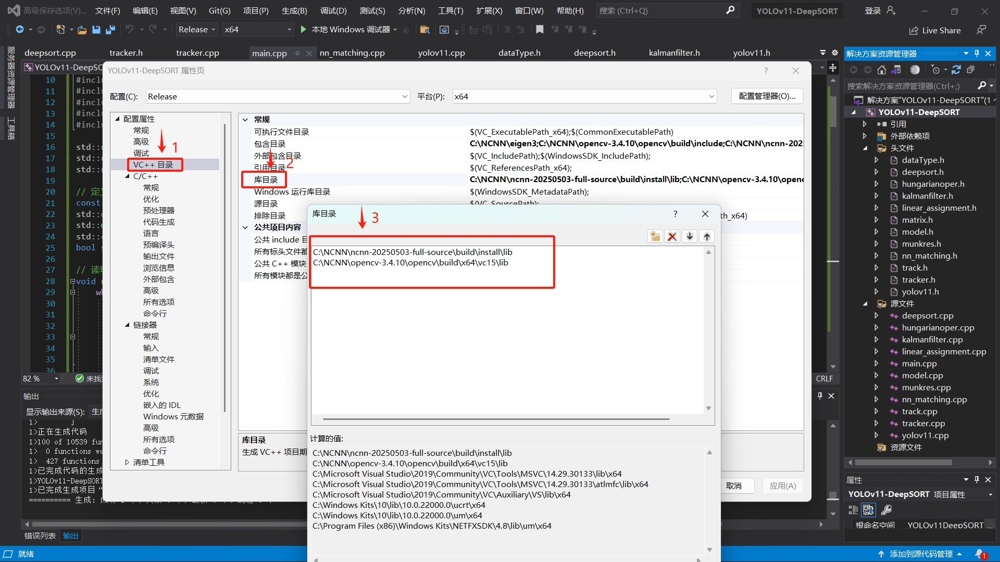
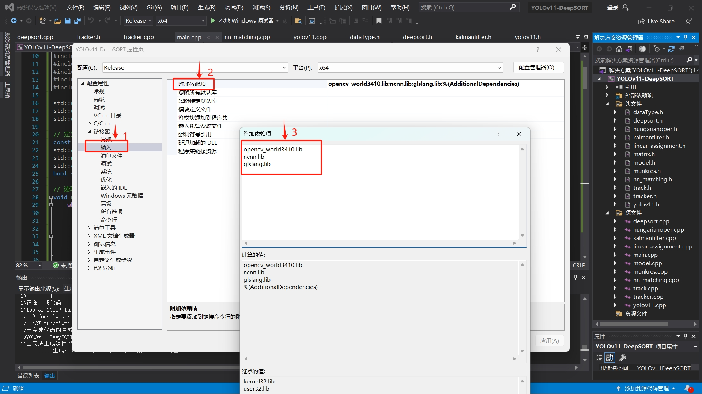
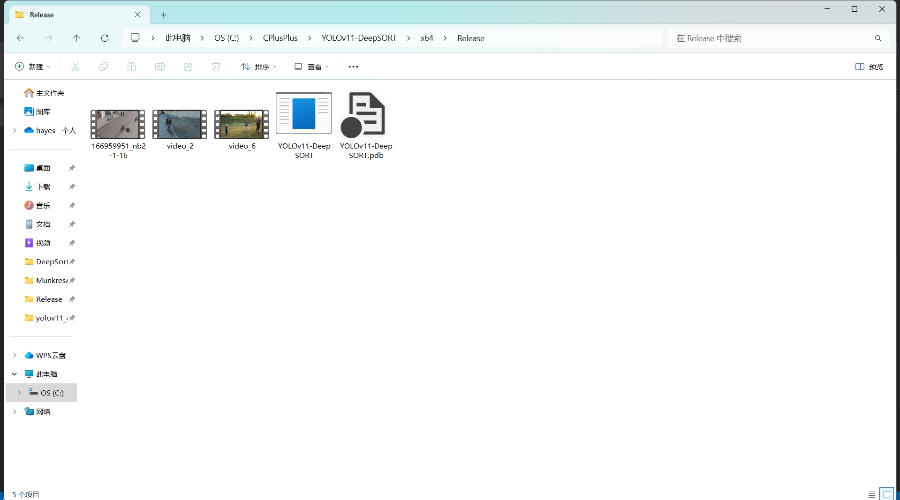
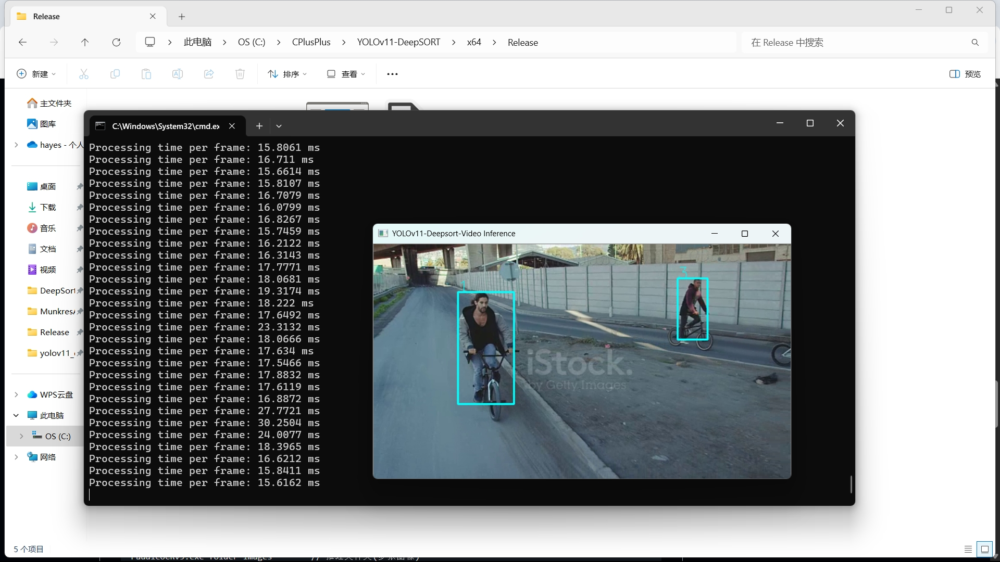

# yolov11_deepsort_ncnn
使用YOLOv11和DeepSort进行行人目标跟踪。(基于ncnn框架，c++实现）


### 写在前面

当前大部分Tracking相关的项目都是基于TensorRT部署的，使用NCNN框架部署的Tracking很少很少，但是对我来说，我更喜欢NCNN框架，因为平台和环境依赖性没那么高，因此想尝试自己用NCNN框架实现一版跟踪项目。

使用的目标检测为YOLOv11的nano版本，而DeepSort算法大部分是参考自[yolov5_deepsort_ncnn_qt](https://github.com/Whu-wxy/yolov5_deepsort_ncnn_qt)项目，不过自己对其进行了部分修改，使其更符合本项目的实现。模型的训练权重是官方提供的预训练权重，自己尝试从pt转到ncnn平台，因为有一些参考教程所以没那么复杂。

老实说Deepsort算法的id跟踪极大程度上依赖于提取的外观特征，我觉得这个算法其实不是很鲁棒，因为如果被跟踪的物体（人）动作幅度过大地话（从站立->摔倒->站立），这个跟踪id就可以切换好几次。另外Deepsort算法需要调整的参数很多，要想获得一个更好的效果，需要进行多次调整才行。本项目对于该部分没有做那么多的关注，只专注于最基本的实现。

本仓库的测试平台为Visual Studio2019，因为电脑内存的原因，暂时没办法在Ubuntu上尝试部署。如果你是想在嵌入式端部署的话，需要自己做一些额外的工作。


### 环境配置

- Visual Studio 2019
- ncnn-20250503-full-source
- opencv-3.4.10
- eigen3

**注：并不需要和本仓库代码的配置环境保持一致，可以根据Visual Studio的版本，下载对应的ncnn和opencv-mobile的版本即可。**


### 推理设置

（1）先在Visual Studio新建一个空白工程，将本仓库代码放到该工程中。把本项目中的`.h`和`.cpp`文件分别导入到`头文件`和`源文件`中。操作结果如下：



（2）在工程中载入推理需要依赖的库。







`附加依赖项`添加的库如下：

```shell
opencv_world3410.lib
ncnn.lib
glslang.lib
```

（3）选择开始执行，应该在工程的**Release**的目录下可以成功地生成`.exe`文件。将测试图像复制到Release下的路径。



（4）执行推理。

推理脚本如下：

```sh
$ YOLOv11-DeepSORT.exe video video_2.mp4   // 推理视频
$ YOLOv11-DeepSORT.exe video 0   // 调用摄像头推理
```




### 推理结果


### 写在后面

1. 本项目有几个需要重点关注的头文件，分别为`deepsort.h`、`yolov11.h`和`tracker.h`。需要配置权重的位置和一些和跟踪结果相关的参数。
2. 从上面的GIF中可以很直观地看出，当检测目标摔倒之后，其id切换得很快，这是基于外观跟踪算法一个弊端吧。我个人觉得DeepSort算法适合那种简单的行人检测，如果被检测对象动作过于丰富的话，那结果一定是不好的。
3. 本项目默认开启了GPU加速，如果没有GPU的话，对于少量检测对象的话，其推理速度影响不大，但是如果是很多检测对象的话，那推理速度可就慢了，因为DeepSort本身就不轻量。
4. 如果有疑问的话，可以开issue提问。如果觉得这个项目还不错的话麻烦给一个star或者fork，可以让我开心一整天。
5. **某些把我开源的代码拿去打包出售的人能不能去死一死，做个人好嘛。**


### Reference

- [yolov5_deepsort_ncnn_qt](https://github.com/Whu-wxy/yolov5_deepsort_ncnn_qt)
- [ncnn-android-yolo11](https://github.com/nihui/ncnn-android-yolo11)
